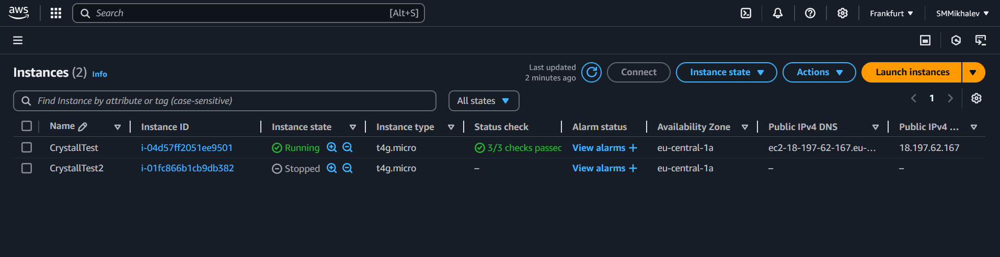
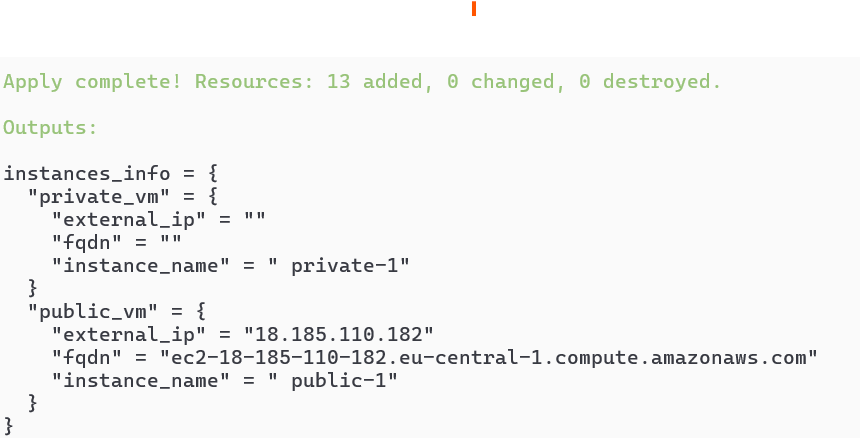
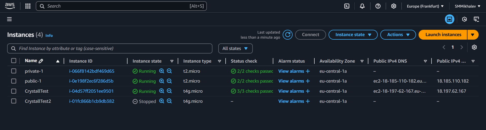
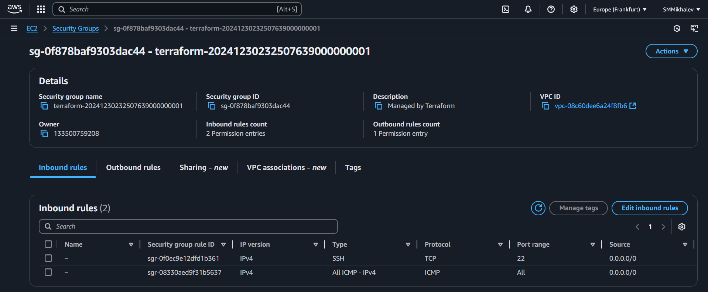
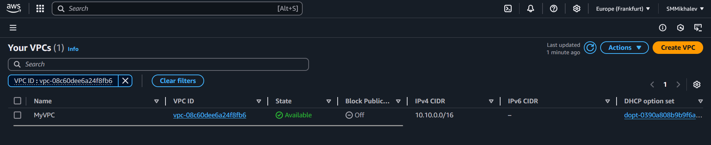
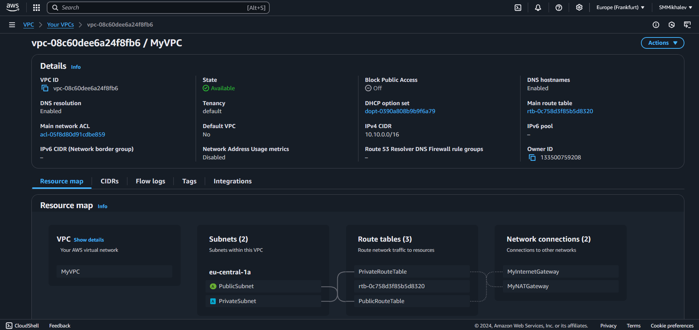
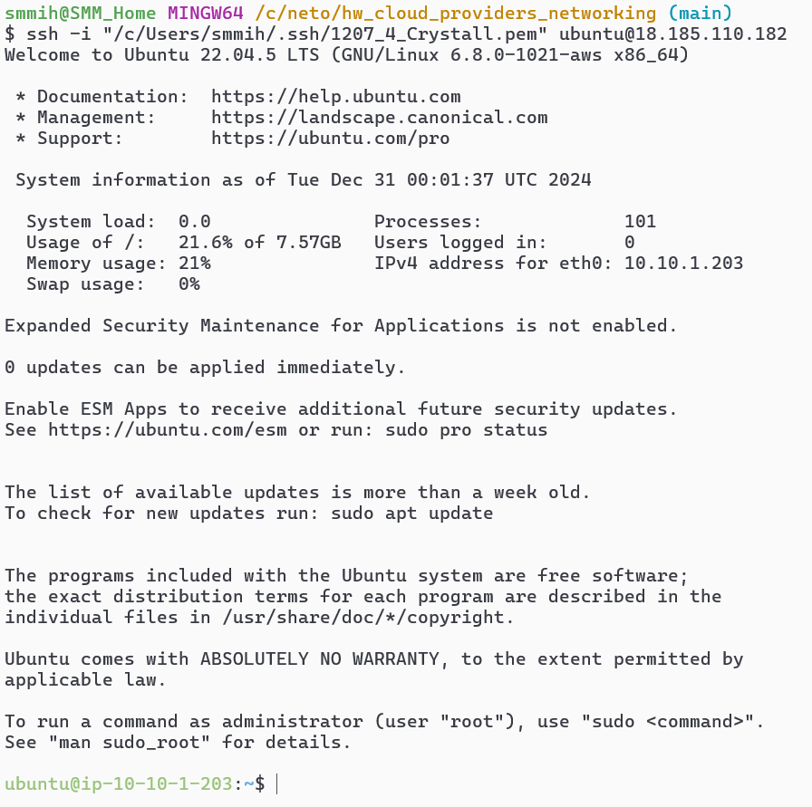
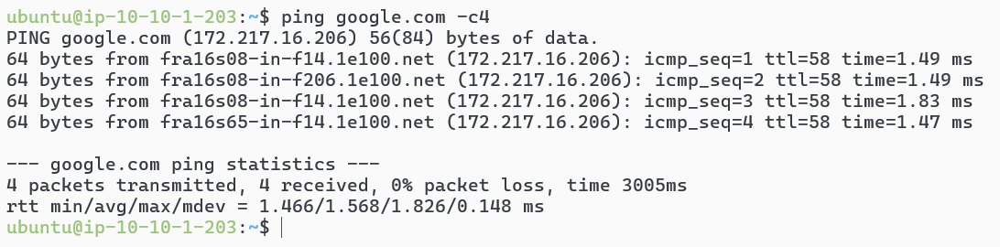
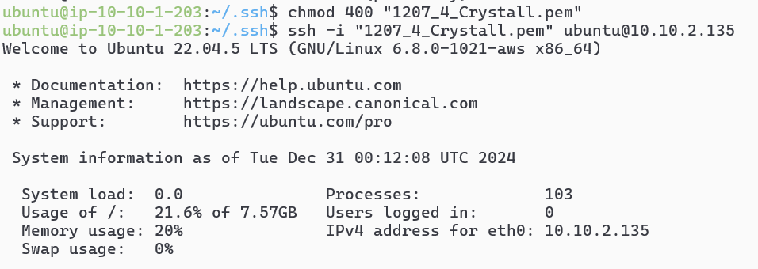
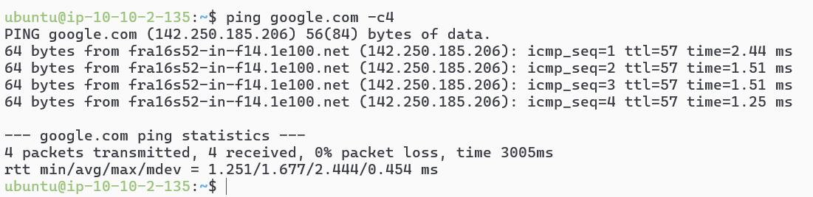

# Домашнее задание к занятию «Организация сети»- Михалёв Сергей

### Подготовка к выполнению задания
Так как я фактически нахожусь в недружественной Европе, то сталкиваюсь с проблемой ограничения на использование платных ресурсов Yandex Cloud. Таким образом могу выполнить только второе задание с исполоьзованием ресурса Anazon AWS.

---

### Задание 2. AWS

**Что нужно сделать**

1. Создать пустую VPC с подсетью 10.10.0.0/16.
2. Публичная подсеть.

 - Создать в VPC subnet с названием public, сетью 10.10.1.0/24.
 - Разрешить в этой subnet присвоение public IP по-умолчанию.
 - Создать Internet gateway.
 - Добавить в таблицу маршрутизации маршрут, направляющий весь исходящий трафик в Internet gateway.
 - Создать security group с разрешающими правилами на SSH и ICMP. Привязать эту security group на все, создаваемые в этом ДЗ, виртуалки.
 - Создать в этой подсети виртуалку и убедиться, что инстанс имеет публичный IP. Подключиться к ней, убедиться, что есть доступ к интернету.
 - Добавить NAT gateway в public subnet.
3. Приватная подсеть.
 - Создать в VPC subnet с названием private, сетью 10.10.2.0/24.
 - Создать отдельную таблицу маршрутизации и привязать её к private подсети.
 - Добавить Route, направляющий весь исходящий трафик private сети в NAT.
 - Создать виртуалку в приватной сети.
 - Подключиться к ней по SSH по приватному IP через виртуалку, созданную ранее в публичной подсети, и убедиться, что с виртуалки есть выход в интернет.

Resource Terraform:

1. [VPC](https://registry.terraform.io/providers/hashicorp/aws/latest/docs/resources/vpc).
1. [Subnet](https://registry.terraform.io/providers/hashicorp/aws/latest/docs/resources/subnet).
1. [Internet Gateway](https://registry.terraform.io/providers/hashicorp/aws/latest/docs/resources/internet_gateway).

### Правила приёма работы

Домашняя работа оформляется в своём Git репозитории в файле README.md. Выполненное домашнее задание пришлите ссылкой на .md-файл в вашем репозитории.
Файл README.md должен содержать скриншоты вывода необходимых команд, а также скриншоты результатов.
Репозиторий должен содержать тексты манифестов или ссылки на них в файле README.md.

---

**Решение**

Список инстансов до начала выполнения задания. 

 
1. Создал пустую VPC [*MyVPC*](modules/network/main.tf) с подсетью 10.10.0.0/16. 
2. Создал публичную подсеть *public*
- Разрешил в этой subnet присвоение public IP по-умолчанию: `map_public_ip_on_launch = true`
- Создал Internet gateway *igw*
- Добавил в таблицу маршрутизации *aws_route_table public* маршрут, направляющий весь исходящий трафик в Internet gateway: `gateway_id = aws_internet_gateway.igw.id`
- Создал security group *default* с разрешающими правилами на SSH и ICMP. Привязал эту security group на все, создаваемые в этом ДЗ, [виртуалки](modules/instances/main.tf).
- Создал в этой подсети виртуалку *public_vm* и убедиться, что инстанс имеет публичный IP (скриншот ниже). Подключиться к ней, убедиться, что есть доступ к интернету (скриншот ниже).
- Добавил NAT gateway [*aws_nat_gateway nat*](modules/network/main.tf) в public subnet.
3. Приватная подсеть.
- Создал в VPC subnet с названием [*private*](modules/network/main.tf), сетью 10.10.2.0/24.
- Создал отдельную таблицу маршрутизации *aws_route_table private* и привязал её к private подсети *aws_route_table_association private*.
- Добавил Route, направляющий весь исходящий трафик private сети в NAT `route {
    cidr_block     = "0.0.0.0/0"
    nat_gateway_id = aws_nat_gateway.nat.id
  }`.
- Создал виртуалку [*private_vm*](modules/instances/main.tf) в приватной сети.
- Подключился к ней по SSH по приватному IP через виртуалку, созданную ранее в публичной подсети (скриншот ниже), и убедился, что с виртуалки есть выход в интернет (скриншот ниже).

Результат запуска `terraform apply` 

Как видно, *public_vm* ВМ имеет публичный адрес 18.185.110.182, в отличии от *private_vm*.

Instance list на Amazon: 

В списке security groups появилась MySecurityGroup. 

MySecurityGroup асоциирована с MyVPC.  

Характеристики и карта сети MyVPC: 

Подключение к *public_vm* через её публичный адрес с использованием ssh ключа:  

Проверка подключения к интернету:  

Подключение к *private_vm* через её публичный адрес с использованием ssh ключа:  

Проверка подключения *private_vm* к интернету:  
